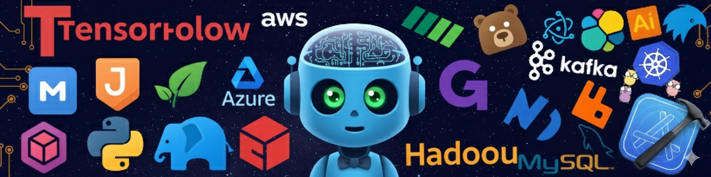
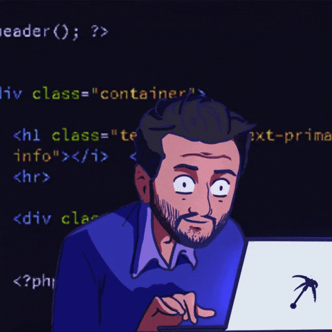

<!-- Banner -->

  

<h1 align="center">Hi 👋, I'm Vũ Văn Thanh Tùng 🧑‍🎓, Web Developer</h1>

  

---

## 👨‍💻 About Me

- 💻 Web Developer passionate about building modern web applications
- 🚀 Focus on clean code & scalable systems
- 🎥 Sharing coding knowledge on TikTok: **Tùng Lập Trình 👨‍💻**
- 🎓 I am a student at Hanoi University of Civil Engineering (Engineering program).
- 📬 Contact me at: **tungvuvanthanh@gmail.com**

---

## 🛠️ Tech Stack

  
  
  
  
  
  

---

## ⚡ What I Do

- 🌐 Build responsive web applications
- 🔥 Develop backend APIs & real-time features
- 📱 Create content to help beginners learn programming

---

## 📊 GitHub Stats

  

---

# 🚀 Programming Languages Showcase 🌟

  

## 🌐 Frontend

## 💻 Backend

## 🏛️ Database

## ⚙️ DevOps

## 🤖 Source code management

## 🧰 OS & IDE & Tools

## ☁️ Cloud

<!-- run image -->

  

## 🎯 Quote

> 💡 _“First, solve the problem. Then, write the code.”_

---

## 🌐 Connect With Me

  
  
   

---

  

  🚀 <strong>Build. Learn. Share.</strong>

